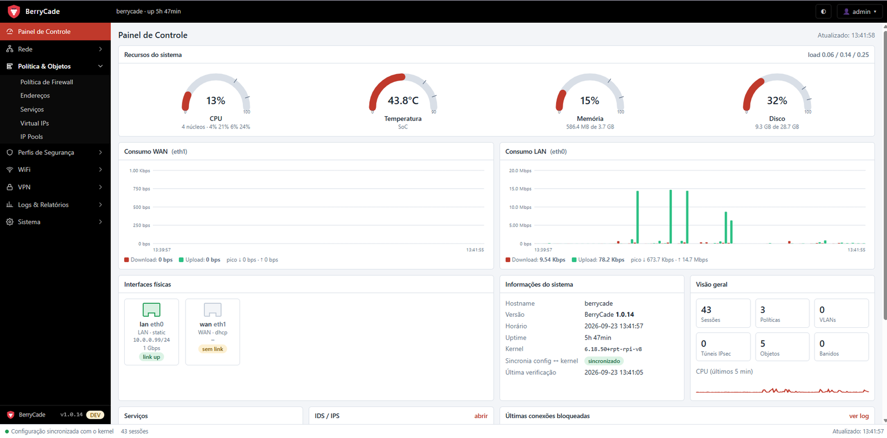
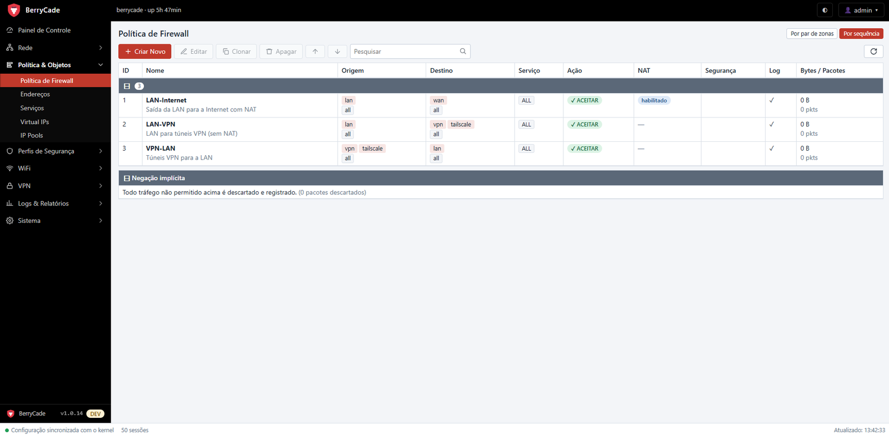
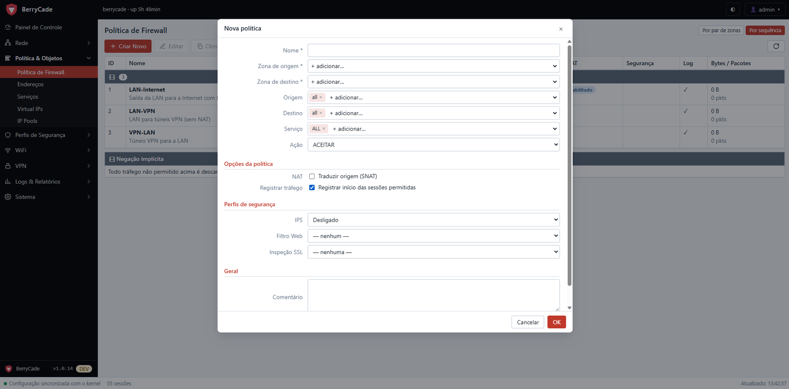
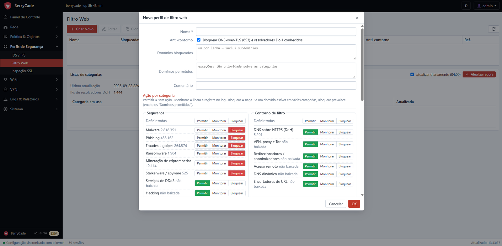
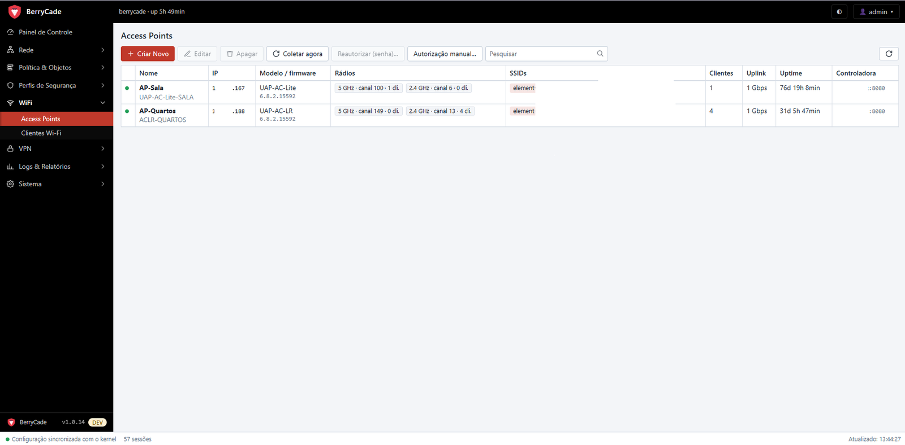
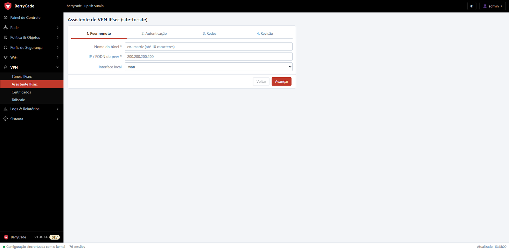
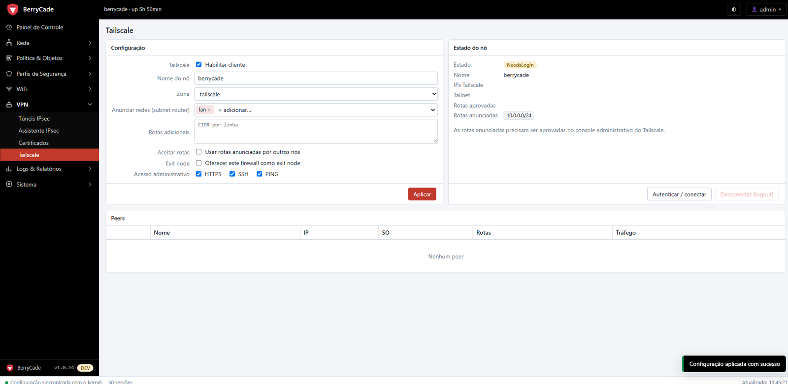

<p align="center">
  
</p>

<h1 align="center">BerryCade</h1>

<p align="center"><b>Secure Pi Networking</b><br>
  Firewall de borda para Raspberry Pi, com <b>nftables puro</b> e gerenciado 100% pelo navegador.
</p>

<p align="center">
  Raspberry Pi 3 · 4 · 5 &nbsp;•&nbsp; Debian 13 "trixie" &nbsp;•&nbsp; nftables · Suricata · strongSwan · Tailscale
</p>

<p align="center">
  
</p>

> [!WARNING]
> **O BerryCade está em BETA.** O projeto ainda está em fase de testes, mas já está disponível para todos
> testarem — e recebe **atualizações constantes**, com novas funções e correções. Pode haver falhas e mudanças
> de comportamento entre versões: teste antes de colocar na borda de uma rede importante e mantenha um backup
> da configuração (Sistema › Backup e Restauração). Encontrou um problema ou tem uma sugestão? Abra uma
> *issue* neste repositório — o retorno de quem testa é o que guia as próximas versões.

---

O **BerryCade** transforma um Raspberry Pi em um firewall completo para a borda da internet: PPPoE, VLANs,
políticas zona → zona com NAT, IDS/IPS, filtro web por categorias, inspeção SSL, VPN IPsec e Tailscale,
monitoramento de access points Wi-Fi e atualizações por firmware assinado. Tudo é configurado por um painel web
no estilo dos firewalls de mercado, sem editar arquivos no sistema.

A configuração é a **fonte da verdade**: cada alteração é validada, testada e aplicada de forma atômica, com
volta automática se você perder o acesso. Toda revisão fica versionada em git.

## Sumário

- [Destaques](#destaques)
- [Telas](#telas)
- [Funcionalidades](#funcionalidades)
- [Hardware](#hardware)
- [Instalação](#instalação)
- [Primeiro acesso](#primeiro-acesso)
- [Como funciona](#como-funciona)
- [Linha de comando](#linha-de-comando)
- [Estrutura do repositório](#estrutura-do-repositório)
- [Listas e regras de terceiros](#listas-e-regras-de-terceiros)

## Destaques

- **Firewall de verdade em um Raspberry Pi**: nftables puro, políticas zona → zona, NAT, VLANs e PPPoE.
- **Segurança em camadas por política**: IPS (Suricata), filtro web por categorias e inspeção SSL, ligados em
  cada regra.
- **Impossível se trancar para fora**: toda alteração precisa ser confirmada pelo navegador *pelas regras novas*;
  sem confirmação em 60 s, a configuração anterior volta sozinha.
- **Nada fora de sincronia**: o painel e o kernel nunca divergem, e um verificador corrige qualquer diferença.
- **Atualizações seguras**: firmware assinado (Ed25519), autoteste antes de ativar e volta automática.
- **Fácil de instalar**: imagem pronta para gravar no cartão e assistente de configuração no primeiro acesso.

## Telas

<p align="center">
  <br>
  <sub><b>Painel de Controle</b> — recursos do sistema, consumo da WAN e da LAN, portas e serviços</sub>
</p>

<table>
  <tr>
    <td width="50%" align="center"><br><sub><b>Política de Firewall</b> — regras zona → zona com NAT, perfis e contadores</sub></td>
    <td width="50%" align="center"><br><sub><b>Editor de política</b> — NAT, log e perfis de segurança na própria regra</sub></td>
  </tr>
  <tr>
    <td width="50%" align="center"><br><sub><b>Filtro Web</b> — permitir, monitorar ou bloquear por categoria</sub></td>
    <td width="50%" align="center"><br><sub><b>Access Points</b> — UniFi monitorado sem controladora</sub></td>
  </tr>
  <tr>
    <td width="50%" align="center"><br><sub><b>Assistente IPsec</b> — VPN site-to-site em quatro passos</sub></td>
    <td width="50%" align="center"><br><sub><b>Tailscale</b> — subnet router e exit node pelo painel</sub></td>
  </tr>
</table>

## Funcionalidades

### Painel de controle

- Medidores de CPU, temperatura, memória e disco, e gráficos de consumo da WAN e da LAN.
- Estado das portas de rede, dos serviços, do IDS/IPS e das últimas conexões bloqueadas.
- Barra de status com sincronia configuração ↔ kernel e número de sessões ativas.

### Rede

- **Interfaces**: portas físicas (onboard ou qualquer adaptador USB-Ethernet), fixadas pelo endereço MAC para não
  trocarem de nome entre reinicializações.
- **WAN** por PPPoE (pppd, PAP/CHAP, MTU e nome de serviço configuráveis), DHCP ou IP fixo.
- **VLANs 802.1Q**: cada VLAN é uma sub-interface com sua própria faixa de IP e pode ter sua própria zona.
- **Zonas**: agrupam interfaces e VLANs; tráfego dentro da zona permitido ou bloqueado; acesso ao próprio firewall
  (HTTPS, SSH, ping, DNS, DHCP) escolhido por zona.
- **Servidor DHCP** por interface/VLAN: faixa, tempo de concessão, DNS, domínio e reservas.
- **Clientes DHCP**: lista em tempo real com menu de botão direito para **reservar** o IP, **revogar** a
  concessão ou **banir** o dispositivo.
- **DNS**: encaminhadores do firewall e dos clientes, DNS do provedor via PPPoE e domínio local (clientes DHCP
  resolvem como `host.domínio`).
- **Rotas estáticas**.

### Política & objetos

- **Políticas de firewall zona → zona**, avaliadas de cima para baixo com negação implícita registrada no log.
  - Origem e destino por zona e por objeto de endereço, serviços, ação (aceitar, negar ou rejeitar) e log.
  - **NAT na própria política**: IP da interface de saída ou um IP pool.
  - Perfis de segurança por política: **IPS**, **filtro web** e **inspeção SSL**.
  - Contadores de bytes e pacotes por regra e contador da negação implícita.
  - Visão **por par de zonas** ou **por sequência** (lembrada por administrador), clonar, habilitar/desabilitar e
    reordenar **arrastando a linha**.
- **Endereços**: sub-rede/IP, faixa de IPs, FQDN e grupos.
- **Serviços**: TCP/UDP (portas e faixas), ICMP, número de protocolo IP e grupos; serviços comuns pré-definidos.
- **Virtual IPs** (port forwarding / DNAT) e **IP Pools** para NAT de origem.
- **NAT central** opcional (como o "Central SNAT" dos firewalls de mercado): tabela única de NAT por zona/VLAN,
  com exceções "sem NAT", no lugar do NAT em cada política.

### Perfis de segurança

- **IDS / IPS com Suricata** via NFQUEUE:
  - modo por zona: desligado, **IDS** (só alerta) ou **IPS** (bloqueia);
  - regras **ET Open** com atualização automática diária;
  - *fail-open*: se o Suricata parar, o tráfego continua passando em vez de derrubar a rede;
  - uso de CPU e das filas, e alertas no painel.
- **Filtro web** por perfil:
  - categorias com ação individual — **permitir**, **monitorar** (só registra) ou **bloquear**;
  - listas públicas baixadas e atualizadas automaticamente (UT1, Block List Project, HaGeZi);
  - domínios liberados e bloqueados manualmente;
  - **anti-bypass**: bloqueia DNS sobre TLS (DoT) e resolvedores DNS sobre HTTPS (DoH);
  - página de bloqueio própria.
- **Inspeção SSL** por perfil:
  - modo **por certificado** (SNI, sem abrir o tráfego) ou **profunda** (ssl-bump, com CA própria para instalar
    nos dispositivos);
  - exceções por categoria (bancos, financeiro) e por domínio;
  - bloqueio de sites com certificado inválido e de QUIC (força HTTPS sobre TCP para poder inspecionar).

### Wi-Fi (UniFi sem controladora)

- Access points **UniFi** monitorados por SSH, sem depender da controladora: adicione com IP, usuário e senha —
  a senha é usada uma única vez para o firewall instalar a própria chave e **não é armazenada**.
- **Clientes Wi-Fi**: sinal, canal, rede, tráfego, fabricante pelo MAC, identificação de MAC privado e
  **nome do dispositivo** (personalizado, DHCP, aprendido pelo AP ou DNS reverso), com opção de renomear.
- Somente leitura: o roaming e a configuração dos APs continuam como estão.

### VPN

- **IPsec (strongSwan)** com **assistente** que esconde fase 1 e fase 2 atrás de poucas perguntas, e modo
  avançado (IKEv1/IKEv2, propostas, tempos de vida, DPD, encapsulamento forçado).
  - Autenticação por chave pré-compartilhada ou por **certificado**.
  - **Certificados**: CA local, emissão de certificados ECDSA e importação da CA do outro lado.
  - O strongSwan só roda quando existe algum túnel.
- **Tailscale** instalado e autenticado pelo painel: **subnet router** (anuncia as redes locais), rotas extras,
  aceitar rotas da tailnet, **exit node** e zona própria nas políticas.

### Logs & relatórios

- Tráfego permitido, **conexões bloqueadas**, eventos do IDS/IPS e acessos do filtro web, filtráveis por zona.
- **Sessões ativas** (conntrack), **auditoria** de todas as ações dos administradores e logs do sistema.

### Sistema

- **Configurações**: hostname, fuso horário, porta HTTPS do painel (troca sem reiniciar), hosts confiáveis,
  tempo de sessão, janela anti-bloqueio, correção automática de divergências e modo de NAT.
- **Aparência**: temas prontos e cores personalizadas (destaque, barra lateral, texto), modo claro/escuro,
  densidade compacta e opção de esconder as dicas.
- **Administradores** com restrição por IP de origem (hosts confiáveis por administrador).
- **Backup e restauração** completos — configuração, administradores, certificados e senhas do PPPoE —
  opcionalmente criptografados (AES-GCM).
- **Revisões**: histórico de todas as alterações, com diferenças e volta para qualquer revisão.
- **Firmware**: atualização por upload de arquivo assinado, com autoteste, volta automática em caso de falha e
  até 3 versões instaladas para voltar quando quiser.
- **Serviços**: monitor de todos os serviços do firewall, mostrando só os que estão em uso.
- **Assistente de primeiro acesso**: escolha das portas LAN/WAN, IP da LAN, tipo de conexão WAN e hostname.

### Segurança do próprio firewall

- Nada exposto na WAN por padrão: entrada bloqueada, painel e SSH apenas nas zonas permitidas.
- Senhas com scrypt, sessões no servidor, cookies `HttpOnly`/`Secure`/`SameSite=Strict` e proteção CSRF.
- Bloqueio de login após tentativas falhas, por IP e por usuário.
- Cabeçalhos de segurança (CSP sem scripts inline, HSTS, `X-Frame-Options`) e somente TLS 1.2+.
- Certificado HTTPS gerado no próprio equipamento; a chave de assinatura de firmware nunca vai para imagens ou
  backups.

### Confiabilidade

- Aplicação atômica: o ruleset nftables inteiro é trocado de uma vez, nunca pela metade.
- Checagens antes de aplicar: `nft -c`, `dnsmasq --test` e `squid -k parse`.
- Firewall carregado no boot antes da rede subir, a partir da última revisão confirmada.
- Serviços systemd com reinício automático e logs estruturados em JSON.

### Distribuição

- **Firmware** `.swfw`: pacote assinado com o código e as dependências, instalado ao lado da versão atual.
- **Imagem para Raspberry Pi** (`.img.xz`, Pi 3/4/5): sistema montado do zero a partir dos repositórios oficiais,
  sem dados do equipamento que gerou; partição expandida no primeiro boot.
- Configuração inicial editável antes de ligar (`berrycade.txt` na partição de boot).

## Hardware

- Raspberry Pi 3, 4 ou 5 (64 bits). Para IDS/IPS, prefira um Pi 4 ou 5 com 4 GB de RAM ou mais.
- Cartão microSD de 8 GB ou mais.
- Uma segunda porta de rede: qualquer adaptador USB-Ethernet (Realtek, ASIX etc.).

## Instalação

1. Baixe a imagem `berrycade-<versão>.img.xz` na página de **Releases** deste repositório e grave com o Raspberry Pi Imager ("Use custom", sem personalização) ou o
   balenaEtcher.
2. Opcional: antes de ligar, edite `berrycade.txt` na partição de boot (hostname, IP da LAN, gateway, DNS).
3. Ligue o Pi com a LAN conectada. No primeiro boot a partição é expandida e o assistente inicial é aberto.

## Primeiro acesso

- Endereço padrão: `https://10.0.0.99/` (LAN 10.0.0.99/24, gateway 10.0.0.254, DNS 8.8.8.8).
- Usuário `admin`, senha `admin` — a troca é obrigatória no primeiro login.
- O assistente inicial pergunta as portas LAN/WAN, o IP da LAN, a conexão WAN e o hostname.

## Como funciona

```
navegador ─HTTPS─▶ API (FastAPI) ─▶ config.yaml (git) ─▶ render ─▶ checagens ─▶ aplicação atômica
                                                           │           │               │
                                     nftables, networkd, dnsmasq,   nft -c,        janela de
                                     pppd, squid, swanctl, suricata dnsmasq --test, confirmação
                                                                    squid -k parse  e rollback
```

Mais detalhes:
- [docs/ARCHITECTURE.md](docs/ARCHITECTURE.md): arquitetura, fluxo de aplicação e marcações de conexão.
- [docs/SCHEMA.md](docs/SCHEMA.md): schema do arquivo de configuração.
- [docs/FIRMWARE.md](docs/FIRMWARE.md): firmware, atualizações e imagens.
- [CHANGELOG.md](CHANGELOG.md): mudanças de cada versão.

## Linha de comando

Para recuperação pelo console ou SSH (como root):

```bash
berrycade status             # serviços e revisão ativa
berrycade revisions          # histórico de revisões
berrycade rollback <rev>     # volta para uma revisão
berrycade apply              # reaplica a configuração
berrycade reset-admin        # redefine admin/admin
berrycade factory-reset      # volta à configuração de fábrica
berrycade users              # usuários do painel, sessões, bloqueios e hosts confiáveis
berrycade passwd <usuário>   # redefine a senha (--temporary gera uma provisória)
berrycade blocked            # usuários e IPs bloqueados por tentativas de login
berrycade unblock <usuário|IP>   # remove o bloqueio (--all remove todos)
berrycade sessions           # sessões abertas no painel
berrycade logout <usuário>   # encerra as sessões de um usuário
```

## Estrutura do repositório

| Caminho | Conteúdo |
|---|---|
| `berrycade/` | Aplicação Python: API, schema, renderizadores, motor de aplicação, serviços, geradores de imagem |
| `web/static/` | Painel (JavaScript puro, sem etapa de build) |
| `bin/` | CLI, atualizador, geradores de imagem, primeiro boot, recuperação |
| `systemd/` | Unidades dos serviços |
| `defaults/` | Configuração de fábrica, Suricata, ulogd, sysctl, udev, boot do Raspberry Pi |
| `squid-errors/` | Páginas de bloqueio do filtro web |
| `docs/` | Arquitetura, schema da configuração, firmware e imagens |
| `secwall/` | Compatibilidade com o atualizador das versões 1.0.x (nome antigo do projeto) |

No equipamento, o código fica em `/usr/lib/berrycade`, a configuração em `/etc/berrycade` e os dados em
`/var/lib/berrycade` e `/var/log/berrycade`.

## Listas e regras de terceiros

O filtro web baixa listas públicas no próprio equipamento: UT1 (Université Toulouse Capitole, CC BY-SA 4.0),
Block List Project e HaGeZi. As regras do IDS são as ET Open (Proofpoint). Nenhuma delas é distribuída neste
repositório; consulte a licença de cada projeto.
